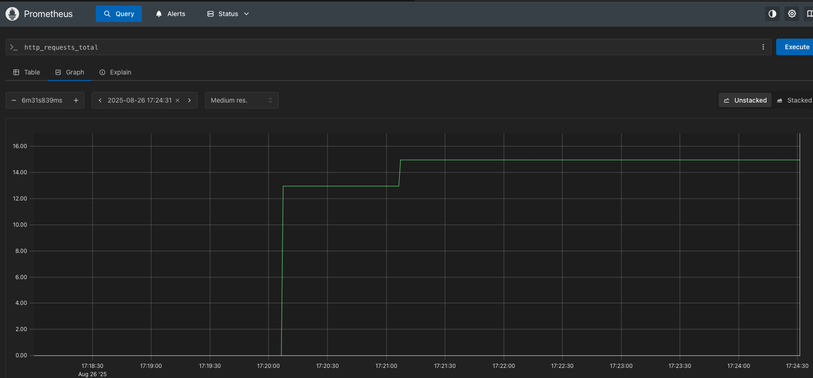
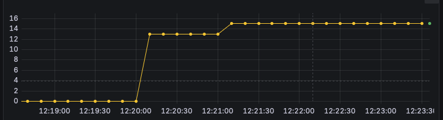

# Go API + Kubernetes + Prometheus + Grafana Demo

This project is a hands-on practice lab for learning how to:
- Build and containerize a Go API
- Deploy to Kubernetes (local via Docker Desktop)
- Automate deployment with Ansible
- Monitor with Prometheus & Grafana

---

## Project Structure

```
mini_server/
├── ansible/
│   ├── playbook.yml        # Ansible tasks to build & deploy app
│   ├── inventory.ini       # Inventory with localhost config
│   └── ansible.cfg
├── app/
│   ├── main.go             # Go API source
│   ├── go.mod
|   ├── go.sum
│   └── Dockerfile
├── k8s/
│   ├── deployment.yaml
│   ├── service.yaml
├── venv
└── README.md
```

---

## Prerequisites

1. [Docker Desktop](https://www.docker.com/products/docker-desktop) installed
2. **Kubernetes enabled** in Docker Desktop
3. **Ansible** installed in your Python virtual environment
4. `kubectl` CLI installed
5. `helm` installed for Prometheus/Grafana setup

---

## Launching the Project

### Start Docker Desktop with Kubernetes
- Open Docker Desktop
- Go to **Settings → Kubernetes** → check **Enable Kubernetes**
- Wait for:
```bash
kubectl get nodes
```
Output should show `Ready`

---

### Deploy App via Ansible
From the project root:
```bash
ansible-playbook -i inventory.ini playbook.yml
```

This will:
1. Build the Go API Docker image
2. Push it locally
3. Apply Kubernetes manifests (`deployment.yaml` and `service.yaml`)

---

### Test the API
Find your NodePort:
```bash
kubectl get svc
```
Call the `/health` endpoint:
```bash
curl http://localhost:<nodeport>/health
```
Expected:
```json
{"status":"ok"}
```

---

## Monitoring

### Install Prometheus
```bash
helm repo add prometheus-community https://prometheus-community.github.io/helm-charts
helm repo update
helm install prometheus prometheus-community/prometheus   --namespace monitoring   --create-namespace
```



### Install Grafana
```bash
helm repo add grafana https://grafana.github.io/helm-charts
helm repo update
helm install grafana grafana/grafana   --namespace monitoring   --set adminPassword='admin'   --set service.type=NodePort
```


### Access Prometheus
```bash
kubectl port-forward -n monitoring deploy/prometheus-server 9090
```
Open browser at
```
http://localhost:9090
```

### Access Grafana
```bash
kubectl get svc -n monitoring grafana
```
Open browser at:
```
http://localhost:30081
```
Login:  
`admin` / `admin`

---

## Adding Prometheus as Data Source in Grafana

1. In Grafana → **Settings → Data Sources → Add Data Source**
2. Choose **Prometheus**
3. URL:
```
http://prometheus-server.monitoring.svc.cluster.local
```
4. Save & Test

---

## Command Cheat Sheet

### **Phase 1 – Local Go API in Docker**
1. **Build Docker image**
   ```bash
   docker build -t status-api:1.0 .
   ```
2. **Run container locally**
   ```bash
   docker run -p 8080:8080 status-api:1.0
   ```
3. **Test the API**
   ```bash
   curl http://localhost:8080/health
   ```

---

### **Phase 2 – Deploy to Kubernetes**
1. **Verify Kubernetes is running**
   ```bash
   kubectl get nodes
   ```
2. **Apply Deployment**
   ```bash
   kubectl apply -f k8s/deployment.yaml
   ```
3. **Apply Service**
   ```bash
   kubectl apply -f k8s/service.yaml
   ```
4. **Verify pods are running**
   ```bash
   kubectl get pods
   ```
5. **Check service details (find NodePort)**
   ```bash
   kubectl get svc
   ```
6. **Test API via NodePort**
   ```bash
   curl http://localhost:<nodeport>/health
   ```

---

### **Phase 3 – Automate with Ansible**
1. **Run Ansible playbook**
   ```bash
   ansible-playbook -i inventory.ini playbook.yml
   ```
2. **Verify everything is running**
   ```bash
   kubectl get pods
   kubectl get svc
   curl http://localhost:<nodeport>/health
   ```